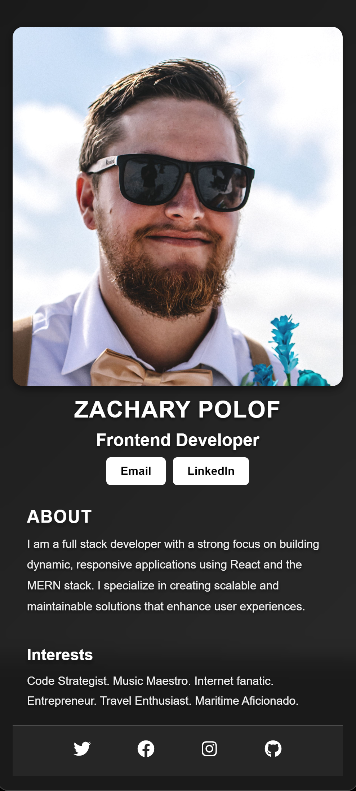

# **Business-Card**

## **Table of Contents**
- [Project Overview](#project-overview)
- [Features](#features)
- [Installation](#installation)
- [Usage](#usage)
- [Technologies Used](#technologies-used)
- [Screenshots](#screenshots)
- [License](#license)

## **Project Overview**
This project is a digital business card showcasing a sleek, modern design with a high-contrast black-and-white color scheme. It includes basic personal information, social media links, and a brief introduction. The design utilizes a glassmorphism effect for a clean and polished appearance.

## **Features**
- Glassmorphism card design for a modern and sleek look.
- Fully responsive layout for mobile and desktop devices.
- High contrast black-and-white theme with subtle animations.
- Easy-to-access social media links using React Icons.

## **Installation**

- clone the repository.
- cd YourRepoName
- npm install - will install required dependencies
- npm run dev - will launch the project

## **Usage**
Once the development server is running, you can view the digital business card in your browser at `http://localhost:5173`.

- Customize the `Info`, `About`, `Interests`, and `Footer` components with your own information.
- Add your own avatar image in the `assets` folder and update the `Info.jsx` component to display it.

## **Technologies Used**

-  - Used for building the user interface.
-  - Used for rendering social media icons.
-  - Used as the build tool and development server.
-  - Used for designing the layout and visual elements. - file available upon request
-  - Used for styling the components and applying glassmorphism effects.

## **Screenshots**

    
    
    

## **License**
This project is licensed under the MIT License - see the [LICENSE](LICENSE) file for details.
